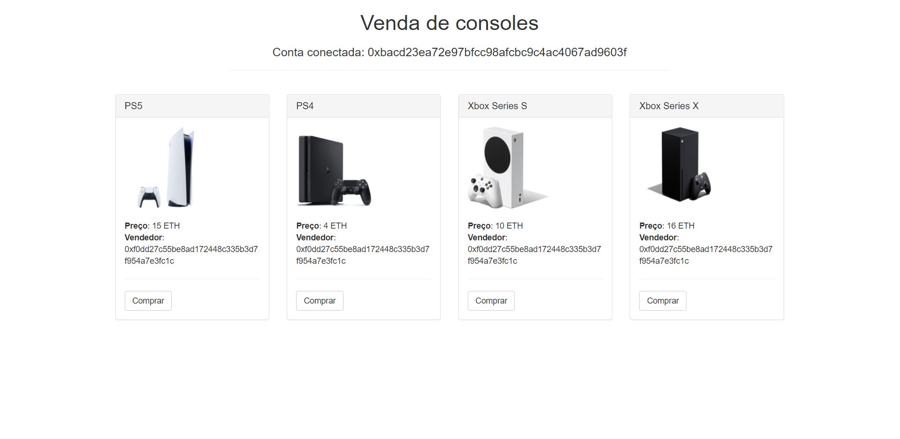
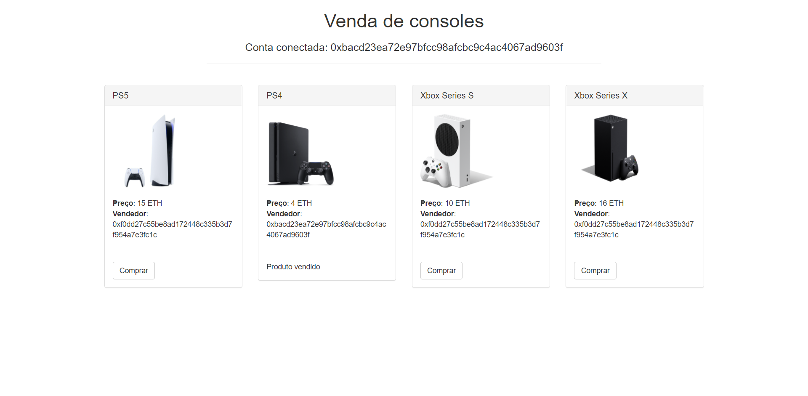
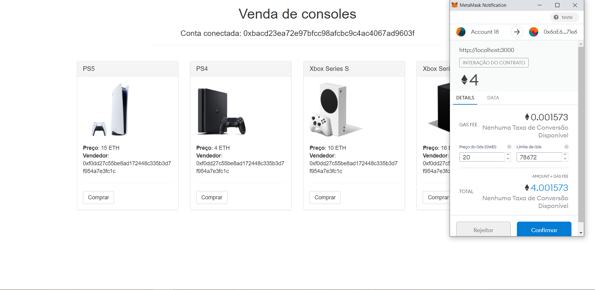

# Marketplace smart contract
Trabalho desenvolvido para disciplina de Blockchain, durante o curso de Ciência da Computação no Instituto Federal de Brasília. Foi implementado um simples smart contract que simula um marketplace, onde contas em uma rede Ethereum podem comprar e vender produtos.

# Ferramentas utilizadas
- Truffle
- Ganache
- Metamask

# Capturas de tela
## Listagem de produtos

  
  

## Compra de produtos

  

